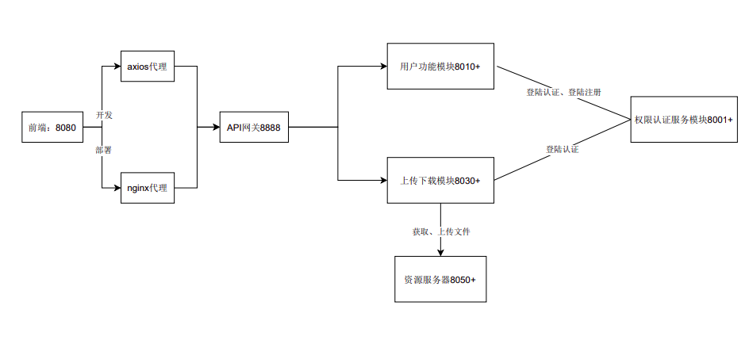
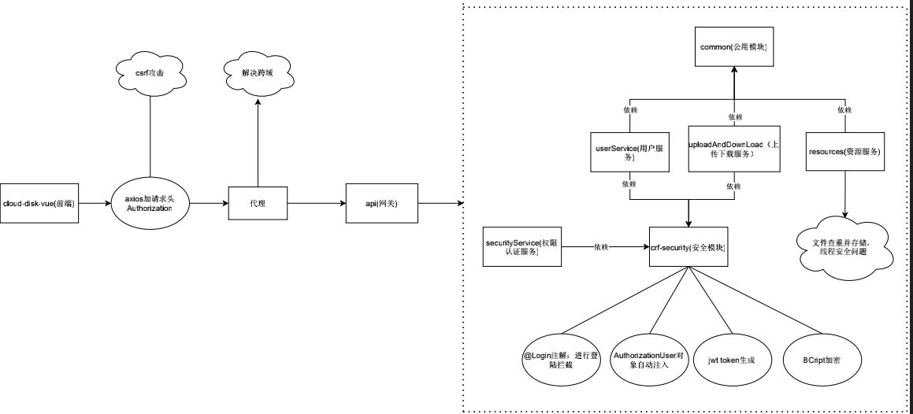

# 共享云盘
采用前后端分离，前端使用vue， 后端使用微服务架构

前端：[cloud-disk-vue](https://github.com/churunfa/cloud-disk-vue)

## 架构设计

## 功能
### 1、注册
使用BCrypt对密码进行加密
### 2、登陆
采用jwt token认证

### 3、上传
1）、实现断点上传

2）、刷新页面可重新选择文件继续上传

处理文件合并时的线程安全问题

### 4、单文件下载
下载链接使用cookie进行认证

### 5、多文件下载
将文件压缩后下载，处理线程安全问题

### 6、回收站
仿照Mac os回收站，文件名加时间戳处理文件名冲突问题，可查看回收站中文件夹子目录，但是只允许从回收站的根目录恢复

### 7、新建文件夹、文件/文件夹重命名、文件/文件夹移动、外链分享

## demo
public文件夹中demo视频
